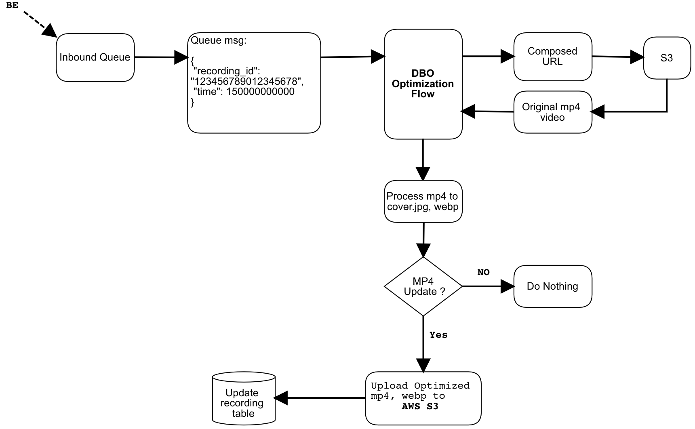

# Dynamic BitRate Optimizer 動態碼率最佳化

This is a multi-function service to handle short videos with RabbitMQ, VMAF...etc.
The python worker process short videos to add watermark, webp files, and parse the video information.

## System Flow Diagram of VMAF Queue Worker

 1. 從inbound message queue取得recording_id。

 2. 用recording_id query db找到url,下載原始mp4。
 
 3. 擷取影片大小縮圖,動圖(共五張),並上傳到相對應的S3, 更新DB。

 4. 以ffmpeg中的constant rate factor(CRF)算法降低碼率，並以Netflix VMAF Index評估影片視覺品質，執行此步至VMAF值不低於threshold，即為最佳化結果。

 5. 上傳最佳化的mp4檔案至相對應的S3 bucket, 更新DB(field: dbo_url)。

  
### Webp Queue Worker

- Required
  - ENV : dev [dev|prod]
  - TYPE: dbo [webp|dbo|watermark|videoinfo]
  - SECRET_FILE: ./config/secret.txt

Required configs in SECRET_FILE(json):

{
            "mysql_api_host_read": "192.17.0.2",
            "mysql_api_host_write": "192.17.0.2",
            "mysql_api_user": "root",
            "mysql_api_pwd": "",
            "mysql_api_db": "",
            "rbmq_hosts": "192.17.0.2,192.17.0.9",
            "rbmq_user": "guest",
            "rbmq_pwd": "guest",
            "rbmq_vhost": "host",
            "aws_access_key_id": "aws_access_key_id",
            "aws_secret_access_key": "aws_secret_access_key"
}
    
## Environment Variables For Dbo
  
### Vmaf Queue Worker

- Required
  - ENV : dev [dev|prod]
  - TYPE: dbo [webp|dbo|watermark|videoinfo]
  - SECRET_FILE: ./config/secret.txt

Required configs in SECRET_FILE(json):
{
            "mysql_api_host_read": "192.17.0.2",
            "mysql_api_host_write": "192.17.0.2",
            "mysql_api_user": "root",
            "mysql_api_pwd": "",
            "mysql_api_db": "",
            "rbmq_hosts": "192.17.0.2,192.17.0.3",
            "rbmq_user": "guest",
            "rbmq_pwd": "guest",
            "rbmq_vhost": "host",
            "aws_access_key_id": "aws_access_key_id",
            "aws_secret_access_key": "aws_secret_access_key"
}

## Environment Variables For Watermark
  
### Watermark Queue Worker

- Required
  - ENV : dev [dev|prod]
  - TYPE: watermark [webp|dbo|watermark|videoinfo]
  - SECRET_FILE: ./config/secret.txt

Required configs in SECRET_FILE(json):
{
            "mysql_api_host_read": "192.17.0.2",
            "mysql_api_host_write": "192.17.0.2",
            "mysql_api_user": "root",
            "mysql_api_pwd": "password",
            "mysql_api_db": "im_test",
            "mysql_activity_host_read": "192.17.0.2",
            "mysql_activity_host_write": "192.17.0.2",
            "mysql_activity_user": "root",
            "mysql_activity_pwd": "",
            "mysql_activity_db": "",
            "mysql_activity_port": "3306",
            "aws_access_key_id": "aws_access_key_id",
            "aws_secret_access_key": "aws_secret_access_key",
            "smart_download": "True",
            "clean_folder": "False",
            "video_download_dir":"./wm_video_cache",
            "task_interval_sec": "200000"
}

## Environment Variables For Videoinfo
  
### Videoinfo Queue Worker

- Required
  - ENV : dev [dev|prod]
  - TYPE: videoinfo [webp|dbo|watermark|videoinfo]
  - SECRET_FILE: ./config/secret.txt

Required configs in SECRET_FILE(json):
{
            "mysql_api_host_read": "192.17.0.2",
            "mysql_api_host_write": "192.17.0.2",
            "mysql_api_user": "root",
            "mysql_api_pwd": "",
            "mysql_api_db": "",
            "task_interval_sec": "60",
            "task_limit": "100"
} 

